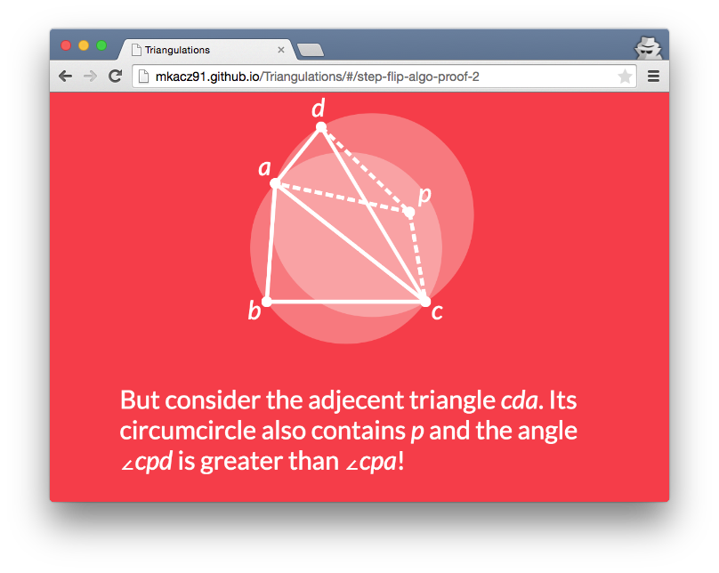
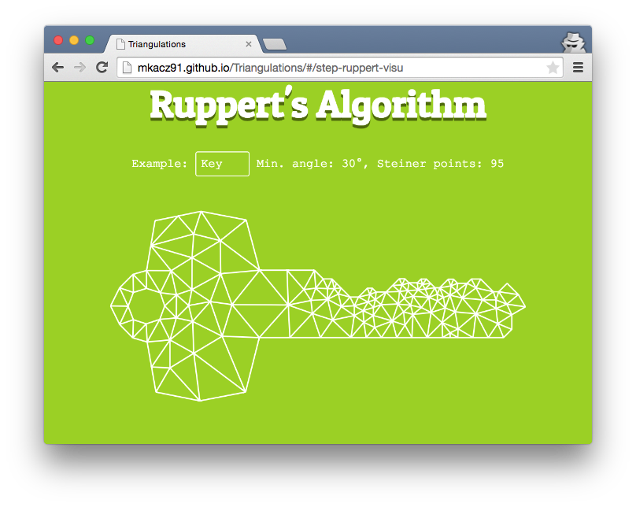

Triangulations
==============

An implementation and presentation of selected mesh generation algorithms. To view online, follow this 
[link](http://mkacz91.github.io/Triangulations) (requires a modern browser and won't work on a mobile device).

This is a presentation initially created for my talk during the Numerical Algorithms Seminar held at the Univertisty of Wrocław in 2015. The slides contain a theoretical description of the algorithms as well as their animated
visualizations, computed live by their JavaScript implementations.

Covered Topics
--------------

  * Polygon Triangulation,
  * PSLG Triangulation,
  * Quadratic Algorithm for PSLG Triangulation
  * Delaunay Triangulation of a Point Set,
  * Constrained Delaunay Triangulation of a PSLG,
  * The Flip algorithm for CDT,
  * Ruppert's Delaunay Refine Algorithm for Quality Triangulation.
  
Credit
------

The work was heavily inspired by Jonathan Schewchuk's [Triangle](http://www.cs.cmu.edu/~quake/triangle.html) library. Some examples are also reconstructions of the ones provided on the website.

References:

  * Jonathan Richard Shewchuk, _Delaunay Refinement Algorithms for Triangular Mesh Generation_, Computational Geometry: Theory and Applications, 22(1-3):21-74, May 2002. ([PostScript]( http://www.cs.berkeley.edu/~jrs/papers/2dj.ps))
  * Jim Ruppert, _A Delaunay Refinement Algorithm for Quality 2-Dimensional Mesh Generation_, Journal of Algorithms 18(3):548-585, May 1995. (PostScript available at Triangle's reference [page](http://www.cs.cmu.edu/~quake/triangle.research.html))
  * Mark de Berg, Otfried Cheong, Marc van Kreveld, Mark Overmars, _Computational Geometry: Algorithms and Applications_, Third Ed., ch. 9, Springer-Verlag, March 2008. (PDF available at the book's [website](http://www.cs.uu.nl/geobook))
  * Marshall Bern and David Eppstein, _Mesh Generation and Optimal Triangulation_, Computing in Euclidean Geometry, 23-90, Ding-Zhu Du and Frank Hwang (editors), World Scientific, Singapore, 1992. (PostScript at Triangle's reference [page](http://www.cs.cmu.edu/~quake/triangle.research.html))

The presentation is made using the [impress.js](https://github.com/bartaz/impress.js) library. Thumbs up for the contributors!
